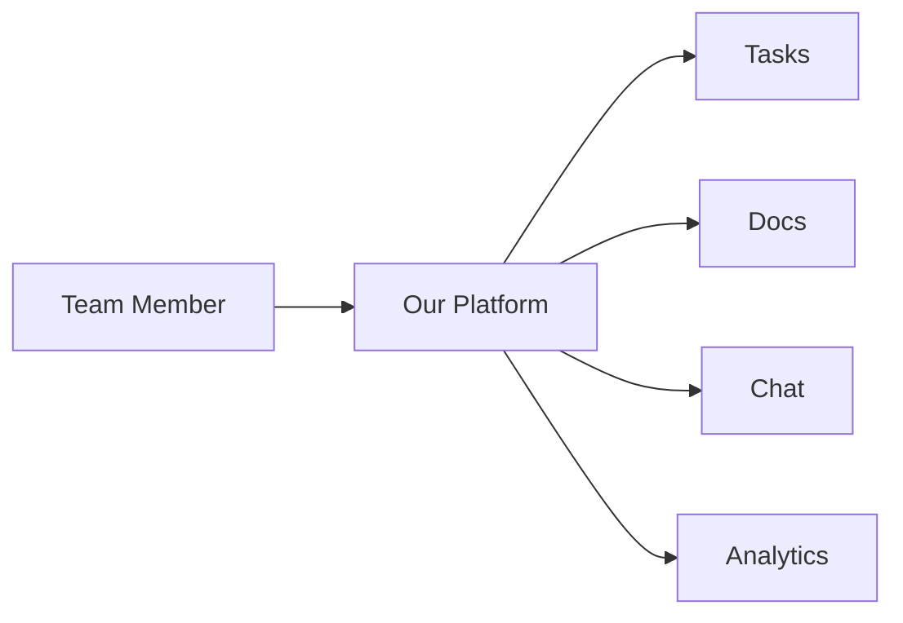
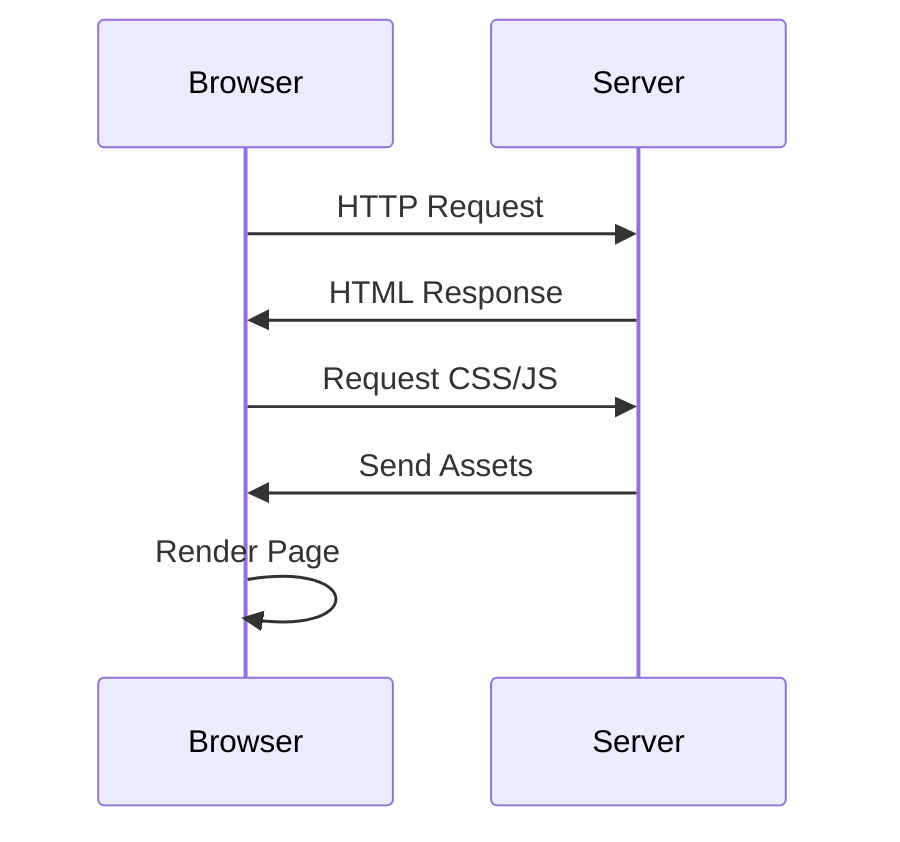

# Slidev Presentation Examples

## Example 1: Simple Technical Presentation

```markdown
---
theme: default
class: text-center
highlighter: shiki
title: Introduction to Python
---

# Introduction to Python

A beginner-friendly guide

---

# What is Python?

<v-clicks>

- 🐍 High-level programming language
- 📚 Easy to learn and read
- 🚀 Powerful for web, data science, AI
- 🌍 Large community and ecosystem

</v-clicks>

---

# Hello World

```python
# Your first Python program
print("Hello, World!")
```

<v-clicks>

- Simple and readable syntax
- No semicolons or curly braces
- Indentation matters!

</v-clicks>

---

# Data Types

```python
# Numbers
age = 25
price = 19.99

# Strings
name = "Alice"

# Lists
fruits = ["apple", "banana", "orange"]

# Dictionaries
person = {"name": "Bob", "age": 30}
```

---

# Control Flow

```python
# If-else
if age >= 18:
    print("Adult")
else:
    print("Minor")

# For loop
for fruit in fruits:
    print(fruit)

# While loop
count = 0
while count < 5:
    print(count)
    count += 1
```

---
layout: center
---

# Questions?

**Thank you for attending!**
```

---

## Example 2: Business Pitch Deck

```markdown
---
theme: default
background: https://images.unsplash.com/photo-1557804506-669a67965ba0
class: text-center
title: Product Launch Pitch
---

# Revolutionary SaaS Platform

Transforming how teams collaborate

<div class="pt-12">
  <span class="text-6xl">🚀</span>
</div>

---
layout: default
---

# The Problem

<v-clicks>

- 📊 Teams waste 3+ hours/week on status updates
- 💬 Information scattered across 10+ tools
- 🔍 Hard to find what you need
- 😓 Burnout from context switching

</v-clicks>

<div v-click class="mt-8 p-4 bg-red-500 bg-opacity-20 rounded">
⚠️ <b>Result:</b> Productivity loss of 15-20% annually
</div>

---
layout: two-cols
---

# The Solution

<v-clicks>

### All-in-one workspace
- Unified dashboard
- Real-time collaboration
- AI-powered insights
- Seamless integrations

### Benefits
- Save 10+ hours/week
- Reduce tool fatigue
- Improve team alignment

</v-clicks>

::right::

<div class="mt-16">



</div>

---
layout: center
---

# Traction

<div class="grid grid-cols-3 gap-8 mt-12">
  <div>
    <div class="text-5xl font-bold">1,200</div>
    <div class="text-xl mt-2">Active Users</div>
  </div>
  <div>
    <div class="text-5xl font-bold">$50K</div>
    <div class="text-xl mt-2">MRR</div>
  </div>
  <div>
    <div class="text-5xl font-bold">95%</div>
    <div class="text-xl mt-2">Retention</div>
  </div>
</div>

---
layout: statement
---

# We're raising $2M

To scale our platform and expand to 10K users

---
layout: end
---

# Let's Talk

**Contact:** hello@startup.com  
**Website:** startup.com

Thank you! 🙏
```

---

## Example 3: Course Material with Diagrams

```markdown
---
theme: default
title: Web Development Basics
highlighter: shiki
---

# Web Development Basics

Understanding the frontend stack

---

# How the Web Works



<v-clicks>

1. Browser sends HTTP request
2. Server responds with HTML
3. Browser requests additional resources
4. Server sends CSS, JavaScript, images
5. Browser renders the complete page

</v-clicks>

---

# HTML Structure

```html
<!DOCTYPE html>
<html>
  <head>
    <title>My Page</title>
    <link rel="stylesheet" href="style.css">
  </head>
  <body>
    <h1>Hello, World!</h1>
    <p>This is my first webpage.</p>
    <script src="script.js"></script>
  </body>
</html>
```

<v-click>

**Key elements:**
- `<head>` - Metadata and links
- `<body>` - Visible content
- `<script>` - JavaScript code

</v-click>

---

# CSS Basics

```css
/* Styling elements */
h1 {
  color: #333;
  font-size: 2rem;
  margin-bottom: 1rem;
}

p {
  line-height: 1.6;
  color: #666;
}

/* Responsive design */
@media (max-width: 768px) {
  h1 {
    font-size: 1.5rem;
  }
}
```

---

# JavaScript Interactivity

```javascript
// DOM manipulation
const button = document.querySelector('#myButton');

button.addEventListener('click', () => {
  alert('Button clicked!');
});

// Fetch data from API
fetch('https://api.example.com/data')
  .then(response => response.json())
  .then(data => console.log(data));
```

---
layout: center
---

# Practice Time! 💻

Build your first webpage using HTML, CSS, and JavaScript

[Open CodePen](https://codepen.io)
```

---

## Example 4: Product Demo

```markdown
---
theme: default
background: linear-gradient(to bottom right, #667eea, #764ba2)
class: text-center text-white
title: Feature Showcase
---

# Our New Feature 🎉

Introducing Smart Analytics

---

# Before vs After

<div class="grid grid-cols-2 gap-8">

<div>

### Before ❌
- Manual data entry
- Static reports
- Weekly updates only
- No insights

</div>

<div>

### After ✅
- Automated tracking
- Real-time dashboards
- Live updates
- AI-powered insights

</div>

</div>

---

# How It Works

<v-clicks>

1. **Connect your data sources** - One-click integrations
2. **AI analyzes patterns** - Automatic insights generation
3. **Get actionable recommendations** - Smart suggestions
4. **Track progress** - Real-time monitoring

</v-clicks>

<div v-click class="mt-8 p-4 bg-green-500 bg-opacity-30 rounded">
✨ <b>Setup time:</b> Under 5 minutes
</div>

---

# Live Demo

<div class="text-left mt-8">

```bash
# Install the CLI
npm install -g analytics-cli

# Connect your account
analytics-cli login

# Start tracking
analytics-cli track --event="page_view"
```

</div>

<v-click>

**See it in action:** [demo.example.com](https://demo.example.com)

</v-click>

---
layout: statement
---

# Available Now

Start using Smart Analytics today

---
layout: end
---

# Get Started

**Docs:** docs.example.com  
**Support:** support@example.com

Thank you! 🙏
```

---

## Tips for Great Presentations

### Structure
1. **Title slide** - Hook the audience
2. **Problem/Context** - Why does this matter?
3. **Solution/Content** - The main message
4. **Examples/Demo** - Show, don't just tell
5. **Conclusion/CTA** - What's next?

### Visual Design
- Use **consistent formatting** throughout
- Apply **progressive disclosure** (`<v-clicks>`)
- Include **visual elements** (emojis, diagrams, images)
- Maintain **white space** - don't overcrowd slides
- Use **color strategically** for emphasis

### Code Presentations
- Always specify **language** for syntax highlighting
- Keep code **concise** - focus on key parts
- Add **comments** to explain complex logic
- Use **realistic examples** - not just "foo bar"

### Engagement
- Start with a **hook** or question
- Use **storytelling** when possible
- Include **visuals** (diagrams, charts, images)
- End with a **clear call-to-action**
