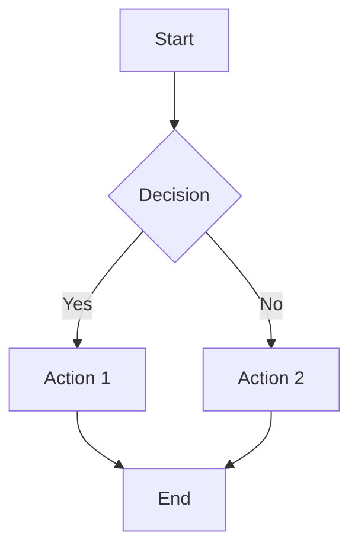
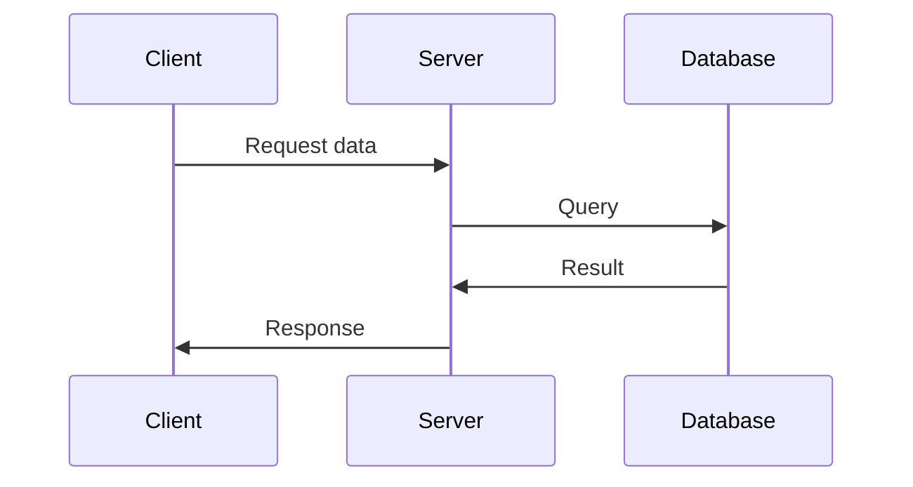
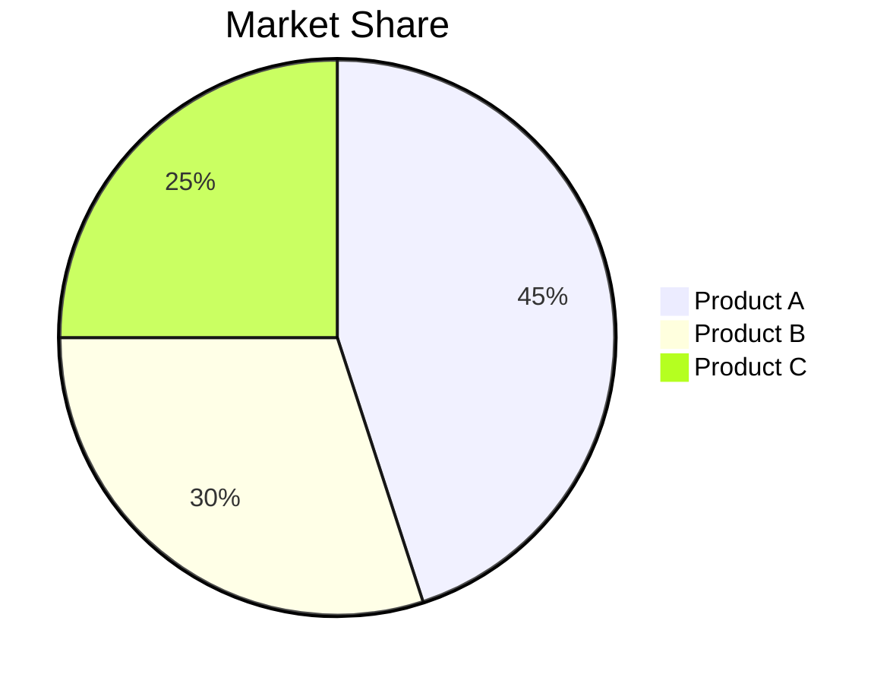
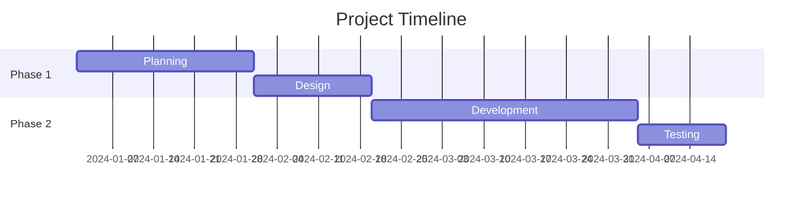

# Advanced Slidev Features

> Source: https://sli.dev/guide/ (updated Feb 2026)

## Table of Contents
1. Themes and Styling
2. Font Configuration (+ Russian/Cyrillic)
3. Layouts (all built-in)
4. Animations and Transitions
5. Diagrams (Mermaid)
6. Interactive Elements
7. Custom Components
8. Speaker Notes
9. Export Options

---

## 1. Themes and Styling

### Available Themes

> Gallery: https://sli.dev/resources/theme-gallery

**Official themes (auto-install on first use):**
| Theme | Style |
|-------|-------|
| `default` | Clean, minimal, professional (recommended) |
| `seriph` | Elegant serif font, dark |
| `apple-basic` | Apple-style minimalism, light/dark |
| `shibainu` | Playful, colorful |
| `bricks` | Bold geometric |
| `neversink` | Modern dark |
| `penguin` | Academic, clean |
| `the-unnamed` | Dark, vibrant |
| `purplin` | Purple gradient |

**Usage:**
```yaml
---
theme: seriph
---
```

**Manual install:**
```bash
npm install @slidev/theme-seriph
```

### Custom Background

**Solid color:**
```yaml
---
background: '#1e293b'
---
```

**Gradient:**
```yaml
---
background: 'linear-gradient(to right, #667eea, #764ba2)'
---
```

**Image:**
```yaml
---
background: 'https://images.unsplash.com/photo-XXXX'
---
```

### Text Classes

```markdown
---
class: 'text-center text-white'
---
```

**Common classes:**
- `text-center` - Center text
- `text-left` - Left align
- `text-right` - Right align
- `text-white` - White text
- `text-sm` - Small text
- `text-lg` - Large text
- `text-2xl`, `text-3xl`, etc. - Extra large

---

## 2. Font Configuration (+ Russian/Cyrillic)

Fonts load automatically from Google Fonts. Configure in headmatter:

```yaml
---
fonts:
  sans: 'Roboto'        # main body text
  serif: 'PT Serif'     # serif variant
  mono: 'Fira Code'     # code blocks
  weights: '300,400,600,700,900'
  italic: false
  provider: google      # or: coollabs | none
---
```

### Best fonts for Russian/Cyrillic

| Font | Character | Use for |
|------|-----------|---------|
| `Roboto` | Modern, neutral | Body, UI, general |
| `Inter` | Clean geometric | Tech, business |
| `Nunito` | Rounded, friendly | Education, courses |
| `PT Sans` | Russian-optimized | Any purpose |
| `PT Serif` | Russian serif | Classic, editorial |
| `Montserrat` | Bold, impactful | Big headings |
| `Source Sans 3` | Neutral, legible | Long-text slides |
| `Raleway` | Elegant, thin | Design-heavy |

### Local fonts (skip Google Fonts CDN)

```yaml
---
fonts:
  sans: 'Helvetica Neue, Roboto'
  local: Helvetica Neue   # won't be fetched from CDN
---
```

### Tips for Cyrillic

- Always specify weight `700` or `900` for bold headings to work
- Avoid decorative/script fonts — most lack Cyrillic glyphs
- Use `--wait 3000` on export if fonts appear as boxes/squares
- PT Sans / PT Serif are specifically designed for Russian

---

## 3. Layouts (all built-in)

### Available Layouts

**`default`** - Standard layout with title and content
```markdown
---
layout: default
---

# Title
Content here
```

**`center`** - Centered content
```markdown
---
layout: center
---

# Centered Title
Centered content
```

**`two-cols`** - Two columns
```markdown
---
layout: two-cols
---

# Left Column

Content for left

::right::

# Right Column

Content for right
```

**`image-right`** - Image on the right
```markdown
---
layout: image-right
image: 'https://example.com/image.jpg'
---

# Content on Left

Image shows on right
```

**`statement`** - Big statement slide
```markdown
---
layout: statement
---

# Big Important Statement

Large, centered, impactful
```

**`quote`** - Quote slide
```markdown
---
layout: quote
---

"This is a quote"

— Author Name
```

**`end`** - Closing slide
```markdown
---
layout: end
---

# Thank You!

Contact info here
```

**`fact`** - Big fact/number with prominence
```markdown
---
layout: fact
---

# 65%

of developers use AI every week
```

**`full`** - Full screen, no padding
```markdown
---
layout: full
---

<div class="h-full bg-gradient-to-r from-violet-500 to-purple-600 flex items-center justify-center">
  <h1 class="text-white text-6xl">Full Screen</h1>
</div>
```

**`image-left`** - Image left, content right
```markdown
---
layout: image-left
image: /path/to/image.jpg
---

# Content on Right

Text goes here
```

**`image`** - Full-screen image
```markdown
---
layout: image
image: /path/to/image.jpg
backgroundSize: cover   # or: contain
---
```

**`iframe-left`** / **`iframe-right`** - Embed a web page
```markdown
---
layout: iframe-left
url: https://example.com
---

# Content on Right
```

**`section`** - Section separator
```markdown
---
layout: section
---

# Part 2: Deep Dive
```

**`two-cols-header`** - Header + two columns
```markdown
---
layout: two-cols-header
---

This spans both columns

::left::

# Left

::right::

# Right
```

**`none`** - No layout styling at all
```markdown
---
layout: none
---

Custom unstyled slide
```

---

## 4. Animations and Transitions

### Progressive Disclosure

**Basic `<v-clicks>`:**
```markdown
<v-clicks>

- First item
- Second item
- Third item

</v-clicks>
```

**Inline clicks:**
```markdown
<v-click>

This appears first

</v-click>

<v-click>

This appears second

</v-click>
```

**Click-based styling:**
```markdown
<div v-click class="bg-blue-500 p-4 rounded">
This box appears on click
</div>
```

**Conditional content:**
```markdown
<div v-click="1">Appears first</div>
<div v-click="2">Appears second</div>
<div v-click="3">Appears third</div>
```

### Slide Transitions

**Set transition in frontmatter:**
```yaml
---
transition: slide-left
---
```

**Available transitions:**
- `slide-left`
- `slide-right`
- `slide-up`
- `slide-down`
- `fade`
- `zoom`
- `none`

**Per-slide transition:**
```markdown
---
transition: fade
---

# This slide fades in
```

---

## 5. Diagrams (Mermaid)

### Flowcharts

```markdown

\```
```

### Sequence Diagrams

```markdown

\```
```

### Pie Charts

```markdown

\```
```

### Gantt Charts

```markdown

\```
```

---

## 6. Interactive Elements

### Buttons and Links

```markdown
<div class="pt-12">
  <span @click="$slidev.nav.next" 
        class="px-4 py-2 bg-blue-600 text-white rounded cursor-pointer">
    Next Slide →
  </span>
</div>
```

### Grid Layouts

```markdown
<div class="grid grid-cols-3 gap-4">
  <div class="p-4 bg-blue-100 rounded">Box 1</div>
  <div class="p-4 bg-green-100 rounded">Box 2</div>
  <div class="p-4 bg-red-100 rounded">Box 3</div>
</div>
```

### Cards

```markdown
<div class="p-6 bg-white shadow-lg rounded-lg">
  <h3 class="text-xl font-bold mb-2">Card Title</h3>
  <p>Card content goes here</p>
</div>
```

---

## 7. Custom Components

### Icons (Carbon Icons)

```markdown
<carbon:arrow-right class="inline"/>
<carbon:checkmark class="text-green-600"/>
<carbon:warning class="text-yellow-600"/>
```

### Badges

```markdown
<span class="px-2 py-1 bg-blue-600 text-white text-sm rounded">
  New
</span>
```

### Highlighting

```markdown
This is <mark>highlighted text</mark>

<div class="bg-yellow-200 p-2 inline-block">
  Important note
</div>
```

---

## 8. Speaker Notes

Add notes visible only in presenter mode:

```markdown
---

# Slide Title

Slide content here

<!--
These are speaker notes.
Only visible in presenter mode.
Remind yourself to:
- Mention the key point
- Tell the story about X
- Demo the feature
-->
```

**Access presenter mode:**
- Start dev server: `npm run dev`
- Open browser to localhost
- Press `P` key for presenter view

---

## 9. Export Options

> Full docs: https://sli.dev/guide/exporting

### PDF (default)
```bash
# Basic
npx slidev export presentation.md --output output.pdf

# Recommended (with timeout)
npx slidev export presentation.md --output output.pdf --timeout 180000

# Dark mode
npx slidev export presentation.md --dark --output output.pdf

# Export specific slide range
npx slidev export presentation.md --range 1,3-5,8 --output output.pdf
```

### PPTX (PowerPoint)
```bash
npx slidev export presentation.md --format pptx --output output.pptx --timeout 180000
```
> Slides are exported as images in PPTX — text won't be selectable.

### PNG (individual images)
```bash
# All slides
npx slidev export presentation.md --format png --timeout 180000

# Single slide
npx slidev export presentation.md --format png --range 1
```

### With click animations
```bash
# Export each click step as separate page
npx slidev export presentation.md --with-clicks --output output.pdf
```

### Fixing render issues
```bash
# Add extra wait before capturing each slide
npx slidev export presentation.md --wait 5000 --timeout 300000

# Change wait strategy (if networkidle causes timeouts)
npx slidev export presentation.md --wait-until domcontentloaded

# Options: networkidle (default) | domcontentloaded | load | none
```

### HTML (interactive, for hosting)
```bash
npx slidev build presentation.md
# Output: dist/ folder
```

**Deploy options:** GitHub Pages, Netlify, Vercel, any static host.

---

## Advanced Styling with UnoCSS

Slidev uses UnoCSS for utility classes:

### Spacing
- `p-4` - Padding
- `m-8` - Margin
- `mt-4` - Margin top
- `px-2` - Padding left/right
- `py-6` - Padding top/bottom

### Colors
- `bg-blue-500` - Background color
- `text-red-600` - Text color
- `border-green-300` - Border color

### Flexbox
- `flex` - Enable flexbox
- `justify-center` - Center horizontally
- `items-center` - Center vertically
- `flex-col` - Column direction

### Grid
- `grid` - Enable grid
- `grid-cols-2` - 2 columns
- `grid-cols-3` - 3 columns
- `gap-4` - Gap between items

### Typography
- `font-bold` - Bold text
- `text-xl` - Extra large
- `text-center` - Center align
- `leading-relaxed` - Line height

### Effects
- `shadow-lg` - Large shadow
- `rounded` - Rounded corners
- `rounded-lg` - Large rounded corners
- `opacity-50` - 50% opacity

### Responsive Design
- `sm:` - Small screens
- `md:` - Medium screens
- `lg:` - Large screens

Example:
```markdown
<div class="p-4 md:p-8 lg:p-12 bg-blue-100 rounded-lg shadow">
  Responsive padding
</div>
```

---

## Best Practices

### Performance
- Optimize images (compress, use appropriate sizes)
- Limit animations on slides with heavy content
- Test export early to catch issues

### Accessibility
- Use sufficient color contrast
- Include alt text for images
- Don't rely solely on color to convey meaning
- Keep text readable (minimum 18pt font)

### Content
- One main idea per slide
- Use visuals to support text
- Keep bullet points concise
- Test readability from a distance

### Technical
- Always specify language for code blocks
- Use `--timeout` flag for large presentations
- Test presenter notes before presenting
- Keep Markdown syntax clean and consistent
