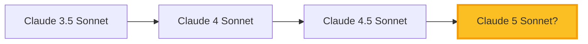

# Claude Sonnet 5 🤖

Слухи, утечки и ожидания от новой модели Anthropic

  
    Начать <carbon:arrow-right class="inline"/>
  

---
layout: default
---

# Что мы знаем точно 📊

<v-clicks>

### Текущая линейка Claude 4
- **Claude Opus 4** — флагманская модель (самая мощная)
- **Claude Sonnet 4** — баланс качества и скорости
- **Claude Haiku 4** — быстрая и доступная

### Последние релизы
- Claude Sonnet 4.5 — февраль 2026
- Claude Opus 4.6 — февраль 2026
- Thinking режим для сложных задач

</v-clicks>

---
layout: two-cols
---

# Слухи и утечки 👀

<v-clicks>

### Из индустрии
- 🔥 Название: Claude Sonnet 5
- 📅 Возможный релиз: Q2-Q3 2026
- 🧠 Архитектура: улучшенный трансформер
- 💬 Внутренние тесты уже идут

### От пользователей
- Замечены новые model IDs в API
- Бенчмарки "утекли" в Reddit
- Anthropic набирает evaluators

</v-clicks>

::right::

⚠️ **Важно**

Большая часть информации — неподтверждённые слухи и спекуляции сообщества.

Официальных анонсов от Anthropic **пока нет**.

---
layout: default
---

# Предполагаемые улучшения 🚀

<v-clicks>

### Производительность
- 📈 **Контекст:** расширение до 500K-1M токенов (сейчас 200K)
- ⚡ **Скорость:** быстрее Sonnet 4.5 на 20-30%
- 💰 **Цена:** вероятно ниже чем Opus 4, выше чем Sonnet 4

### Возможности
- 🧮 **Reasoning:** улучшенные способности к логике и математике
- 💻 **Coding:** лучшее понимание кода и отладка
- 🌍 **Мультимодальность:** улучшенная работа с изображениями
- 🔧 **Tool use:** более точное использование инструментов

</v-clicks>

---
layout: center
---

# Сравнение поколений

**Паттерн:** Каждая версия приносит ~25-40% улучшение на бенчмарках

---
layout: default
---

# Когда ждать? 📅

<v-clicks>

### Таймлайн релизов Anthropic
- **Q4 2025:** Claude 4 Opus, Sonnet, Haiku
- **Q1 2026:** Claude 4.5 Sonnet, Opus 4.6
- **Q2-Q3 2026:** Claude 5 Sonnet (слухи)

### Признаки скорого релиза
- 🔬 Активность в GitHub issues
- 📊 Новые бенчмарки в Papers with Code  
- 💼 Вакансии на "model evaluation"
- 🎤 Анонсы на конференциях (GTC, ICLR)

</v-clicks>

🎯 <b>Прогноз:</b> Если слухи верны — релиз возможен в мае-июле 2026

---
layout: default
---

# Что это значит для индустрии 🌍

<v-clicks>

### Для разработчиков
- Новые возможности для AI-приложений
- Более сложные агенты и автоматизация
- Лучшее качество при той же цене

### Для бизнеса
- Снижение затрат на inference
- Более точные результаты → меньше ошибок
- Конкуренция с GPT-5 и Gemini 3 Pro

### Для экосистемы
- Повышение планки для всей индустрии
- Новые кейсы применения ИИ
- Ускорение AI-трансформации

</v-clicks>

---
layout: statement
---

# Главное ⚡

**Подтверждённых фактов мало, но сигналы указывают на релиз в ближайшие месяцы**

---
layout: center
class: text-center
---

# Источники информации 📚

<v-clicks>

- 🔗 **Официальный блог Anthropic** — anthropic.com/news
- 💬 **Reddit:** r/ClaudeAI, r/LocalLLaMA
- 🐦 **Twitter:** @AnthropicAI, инсайдеры индустрии
- 📊 **Benchmarks:** Papers with Code, LMSYS Chatbot Arena
- 📰 **Tech-медиа:** TechCrunch, The Verge, VentureBeat

</v-clicks>

⚠️ Всегда проверяйте информацию — много фейков и спекуляций!

---
layout: end
---

# Следим за новостями! 🚀

**Александр Унгуренко**  
Telegram: @ungurenko

Создано с помощью Slidev • Февраль 2026

