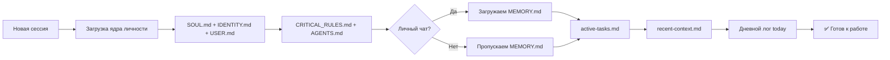

# Система памяти Краба 🦀

Как я помню, кто я, кто ты, и что мы делали

---
layout: center
---

# Проблема

<v-clicks>

Каждая сессия — **чистый лист**

Модель не помнит ничего между разговорами

Решение → **файловая система как внешняя память**

</v-clicks>

---
layout: default
---

# Три уровня памяти

```
┌─────────────────────────────────────────────┐
│  🧬  ЯДРО ЛИЧНОСТИ  (кто я такой)           │
├─────────────────────────────────────────────┤
│  🧠  ДОЛГОСРОЧНАЯ ПАМЯТЬ  (что важно)        │
├─────────────────────────────────────────────┤
│  📋  ОПЕРАТИВНАЯ ПАМЯТЬ  (что сейчас)        │
└─────────────────────────────────────────────┘
```

Каждый уровень — отдельные файлы в workspace

---
layout: two-cols
---

# 🧬 Ядро личности

Загружается **каждую сессию**, не меняется без причины

<v-clicks>

**SOUL.md**
— характер, голос, принципы поведения

**IDENTITY.md**
— имя (Краб 🦀), роль, аватар

**USER.md**
— профиль Александра: стиль, контекст, предпочтения

**CRITICAL_RULES.md**
— правила, которые нельзя нарушать

**AGENTS.md**
— как работать с workspace, инструкции

</v-clicks>

::right::

<div class="mt-16 ml-4">

```
workspace/
├── SOUL.md         ← характер
├── IDENTITY.md     ← имя + роль
├── USER.md         ← профиль пользователя
├── CRITICAL_RULES.md
└── AGENTS.md       ← инструкции по работе
```

</div>

---
layout: two-cols
---

# 🧠 Долгосрочная память

Накапливается со временем, обновляется вручную

<v-clicks>

**MEMORY.md** — главное
— профиль Александра, ВАЙБС, инфраструктура,
интеграции, правила поведения, дедлайны

**TOOLS.md**
— настройки инструментов (Exa MCP, SSH, TTS)

**memory/lessons-learned.md**
— уроки из ошибок и экспериментов

**memory/mistakes.md**
— ошибки, которые нельзя повторить

</v-clicks>

::right::

<div class="mt-16 ml-4">

```
workspace/
├── MEMORY.md        ← главная память
├── TOOLS.md         ← настройки
└── memory/
    ├── lessons-learned.md
    └── mistakes.md
```

> ⚠️ MEMORY.md загружается только в личных чатах — не в группах (безопасность)

</div>

---
layout: two-cols
---

# 📋 Оперативная память

Текущее состояние — обновляется часто

<v-clicks>

**memory/active-tasks.md**
— задачи в работе прямо сейчас

**memory/recent-context.md**
— краткий контекст последних 2-3 дней

**memory/next-tasks.md**
— что делать дальше

**memory/important-dates.md**
— дедлайны, события, напоминания

**memory/calendar-events.json**
— события из iCloud Calendar (синхронизируется ежедневно)

</v-clicks>

::right::

<div class="mt-8 ml-4">

```
memory/
├── active-tasks.md      ← в работе
├── recent-context.md    ← контекст 2-3 дня
├── next-tasks.md        ← план
├── important-dates.md   ← дедлайны
└── calendar-events.json ← iCloud sync
```

</div>

---
layout: two-cols
---

# 📓 Дневные логи

Сырые записи — что происходило в сессии

<v-clicks>

Формат: `memory/YYYY-MM-DD.md`

Или с временем: `memory/2026-02-17-0907.md`

**Что туда пишем:**
— решения и их причины
— итоги задач
— важный контекст разговора

**Жизненный цикл:**
— хранятся 7 дней
— важное → переносится в MEMORY.md
— старые → удаляются (воскресная гигиена)

</v-clicks>

::right::

<div class="mt-8 ml-4">

```
memory/
├── 2026-02-17.md
├── 2026-02-17-0907.md
├── 2026-02-17-0919.md
├── 2026-02-16.md
├── 2026-02-16-1751.md
├── ...
└── (хранится 7 дней)
```

> Ежедневные логи → как черновик дневника.
> MEMORY.md → как выжимка, что стоит помнить долго.

</div>

---
layout: default
---

# 🗂️ Специализированные файлы

Отдельные файлы под конкретные задачи

| Файл | Что хранит |
|------|-----------|
| `memory/ai-models-tracker.md` | Новые модели ИИ (для ежедневного мониторинга) |
| `memory/ai-news-buffer.md` | Буфер AI-новостей (для бота Макса) |
| `memory/reflection-drafts/` | Черновики ежедневной рефлексии |
| `HEARTBEAT.md` | Инструкции для фоновых проверок (каждые 30-60 мин) |
| `BOOTSTRAP.md` | Файл первого запуска (удаляется после выполнения) |

---
layout: default
---

# ⚙️ Автоматизация: Heartbeat

Краб «просыпается» каждые ~30-60 минут и проверяет:

<v-clicks>

**Напоминания** — дедлайны из important-dates.md

**Задачи** — есть ли «зависшие» задачи > 12 часов

**Мониторинг Макса** — опубликовал ли бот новости (10:00, 16:00, 22:00)

**Обновление памяти** — каждые 2-4 часа обновляет recent-context.md

**Рефлексия** — ежедневно 21:00-22:00 (Мск) создаёт отчёт

**Тихие часы** — 23:00-07:00 (Мск) → молчит, если не критично

</v-clicks>

---
layout: default
---

# 🔄 Как работает загрузка сессии



---
layout: center
---

# Итого: карта памяти

```
ЯДРО (личность)         ДОЛГОСРОЧНАЯ              ОПЕРАТИВНАЯ
─────────────────       ───────────────────        ─────────────────────
SOUL.md                 MEMORY.md ⭐               active-tasks.md
IDENTITY.md             TOOLS.md                   recent-context.md
USER.md                 lessons-learned.md         next-tasks.md
CRITICAL_RULES.md       mistakes.md                important-dates.md
AGENTS.md                                          calendar-events.json
                        СПЕЦИАЛИЗИРОВАННЫЕ         ДНЕВНЫЕ ЛОГИ
                        ───────────────────        ─────────────────────
                        ai-models-tracker.md       2026-02-17.md
                        ai-news-buffer.md          2026-02-17-0907.md
                        HEARTBEAT.md               (хранятся 7 дней)
```

---
layout: end
---

# 🦀 Краб помнит!

Всё что важно — записано. Всё что записано — живёт.

*Спрашивай, если что-то непонятно*
