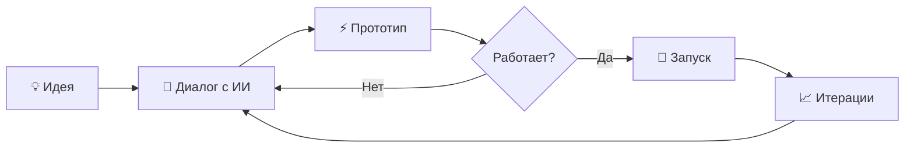

# Вайб-кодинг 🚀

Создавай IT-сервисы через ChatGPT и Claude Code

<div class="pt-12">
  <span @click="$slidev.nav.next" class="px-2 py-1 rounded cursor-pointer" hover="bg-white bg-opacity-10">
    Начать <carbon:arrow-right class="inline"/>
  </span>
</div>

---
layout: default
---

# Что такое вайб-кодинг? 🤔

<v-clicks>

- 🎯 **Не нужно быть программистом** — управляй ИИ, а он пишет код
- ⚡ **Быстро** — от идеи до рабочего прототипа за 1-2 часа
- 🛠️ **Реальные сервисы** — Telegram-боты, сайты, веб-приложения
- 💡 **Идеально для экспертов** — делай инструменты для своей аудитории

</v-clicks>

<div v-click class="mt-8 p-4 bg-blue-500 bg-opacity-20 rounded">
💬 <b>Вайб = настроение + интуиция + итерации</b><br/>
Не жёсткое ТЗ, а диалог с ИИ до результата
</div>

---
layout: two-cols
---

# Инструменты 🧰

<v-clicks>

### ChatGPT Codex
- Диалоговый режим
- Пишет и правит код
- Запускает приложения

### Claude Code
- Работает с файлами
- Git, Docker, npm
- Дебаггинг и рефакторинг

</v-clicks>

::right::

<div v-click class="mt-16">

```python
# Пример: Telegram-бот за 5 минут

from telegram import Update
from telegram.ext import Application

async def start(update, context):
    await update.message.reply_text(
        '👋 Привет! Я твой бот!'
    )

app = Application.builder().token(TOKEN).build()
app.add_handler(CommandHandler('start', start))
app.run_polling()
```

</div>

---
layout: center
class: text-center
---

# Процесс вайб-кодинга ⚙️



<div v-click class="mt-8">
🎯 <b>Главное правило:</b> Не бойся ошибок — ИИ их исправит!
</div>

---
layout: statement
---

# Результат? 🎁

<v-clicks>

- 🤖 Чат-боты для клиентов
- 📊 Дашборды и аналитика  
- 🌐 Лендинги и сайты
- 🔧 Автоматизация рутины
- 💰 **Новые продукты для продажи**

</v-clicks>

<div v-click class="mt-12 text-2xl">
<b>Курс ВАЙБС</b> — научим создавать всё это за 3 недели 🔥
</div>

---
layout: center
class: text-center
---

# Готов попробовать? ⚡

### Присоединяйся к курсу ВАЙБС

<div class="mt-8">

**Старт:** 21 февраля  
**Цена:** 19 990 ₽  
**Формат:** Групповое наставничество

</div>

<div class="mt-12">
<a href="https://t.me/ungurenko" class="px-6 py-3 bg-blue-600 rounded-lg text-white font-bold hover:bg-blue-700">
  Записаться на курс →
</a>
</div>

---
layout: end
---

# Спасибо! 🦀

**Александр Унгуренко**  
Telegram: @ungurenko

<div class="mt-8 text-sm opacity-70">
Создано с помощью Slidev + Claude Code 🚀
</div>
